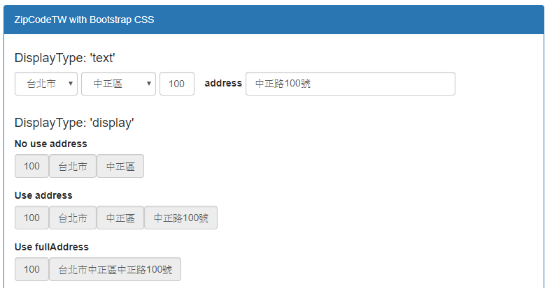

# zipcode-tw-react

提供台灣縣市、行政區下拉選單以及郵遞區號輸入欄位組合的React Component  
藉由RawData快速進行郵遞區號切換

## Demo
Tyr it online: https://chris-tsai.github.io/



## Installation

```bash
npm install zipcode-tw-react --save
```
or use package.json

```bash
"dependencies": {
      ...
    + "zipcode-tw-react": "^1.0.6",
 },
```

## Usage

```javascript
import {ZipCodeTW} from "zipcode-tw-react";

<ZipCodeTW displayType="text"
          ...
/>
```
Example : [zipcode-tw-react-example](https://github.com/Chris-Tsai/zipcode-tw-react/tree/master/_example) 

## Prop

###### Field

 Name | Type | Default | Description
:--- | :--- | :--- | :---
displayType| one of: 'text', 'display' | 'text' | displayType= display時，以span顯示且包含readOnly & disabled屬性
countyFieldName | string |'county' |
countyValue | string | |
districtFieldName | string |'district' |
districtValue | string | |
zipCodeFieldName | string |'zipCode' |
zipCodeValue | string | |
countyClass | string |'form-control' |
countyStyle | object | {} |
districtClass | string |'form-control' |
districtStyle | object | `displayType= 'text'時預設為 {marginLeft:'5px', minWidth:'107px', paddingRight:'0px'}` |
zipClass | string | 'form-control'|
zipStyle | object | `displayType= 'text'時預設為 {marginLeft:'5px', width: '50px'}`|
zipCodePlaceholder | string | |
fullAddress | string | | 完整地址(優化顯示)
address | string | | 路段地址資訊(優化顯示)

###### Method

 Name | Return | Description
 :---  | :--- | :--- 
 handleChangeCounty | {countyFieldName, countyValue, districtFieldName, districtValue, zipFieldName, zipValue}
 handleChangeDistrict | {countyFieldName, countyValue, districtFieldName, districtValue, zipFieldName, zipValue}
 handleChangeZipCode | {zipFieldName, zipValue}
 handleBlurZipCode | {countyFieldName, countyValue, districtFieldName, districtValue, zipFieldName, zipValue}
 handleZipCodeNotExists | {countyFieldName, countyValue, districtFieldName, districtValue, zipFieldName, zipValue, origZipCode}

## Stargazers over time

[](https://starcharts.herokuapp.com/Chris-Tsai/zipcode-tw-react)
      
