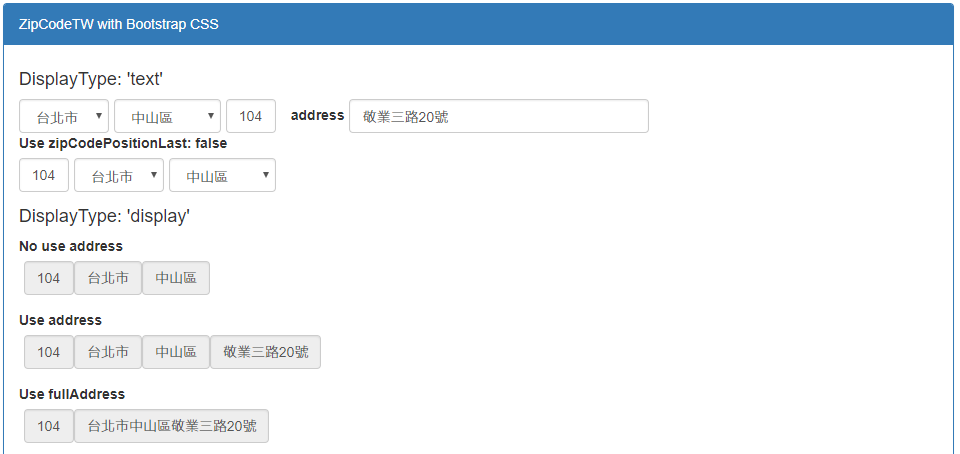

# zipcode-tw-react
提供台灣縣市、行政區下拉選單以及郵遞區號輸入欄位組合的React Component  
藉由RawData快速進行郵遞區號切換，並提供地址合併顯示。

[](https://travis-ci.org/Chris-Tsai/zipcode-tw-react.svg?branch=master)
[](https://coveralls.io/github/Chris-Tsai/zipcode-tw-react?branch=master)

## Demo
Tyr it online: https://chris-tsai.github.io/



## Installation

```bash
npm install zipcode-tw-react --save
```
or use package.json

```bash
"dependencies": {
      ...
    + "zipcode-tw-react": "^1.1.3",
 },
```

## Usage

```javascript
import {ZipCodeTW} from "zipcode-tw-react";

<ZipCodeTW displayType="text"
          ...
/>
```
Example : [zipcode-tw-react-example](https://github.com/Chris-Tsai/zipcode-tw-react/tree/master/_example) 

## Props

###### Field

 Name | Type | Default | Description
:--- | :--- | :--- | :---
displayType| one of: 'text', 'display' | 'text' | displayType= display<br/>1. 以span顯示且包含readOnly & disabled屬性<br/>2. 提供fullAddress、address參數合併顯示郵遞區號及地址
zipCodePositionLast| bool | true| Decide zipCode input text position, <br/>when displayType= display, position is fixed 
countyFieldName | string |'county' |
countyValue | string | |
districtFieldName | string |'district' |
districtValue | string | |
zipCodeFieldName | string |'zipCode' |
zipCodeValue | string | |
countyClass | string |'form-control' |
countyStyle | object | {} |
districtClass | string |'form-control' |
districtStyle | object | displayType= 'text'<br/>預設為 {marginLeft:'5px', minWidth:'107px', paddingRight:'0px'} |
zipClass | string | 'form-control'|
zipStyle | object | displayType= 'text'<br/>預設為 {marginLeft:'5px', width: '50px'}|
zipCodePlaceholder | string | |
fullAddress | string | | 完整地址(優化顯示)
address | string | | 路段地址資訊(優化顯示)
addressClass | string | 'form-control'|
addressStyle | object | {} |

###### Method

 Name | Return | Description
 :---  | :--- | :--- 
 handleChangeCounty | { countyFieldName, countyValue, <br/>districtFieldName, districtValue, <br/>zipFieldName, zipValue }
 handleChangeDistrict | { countyFieldName, countyValue, <br/>districtFieldName, districtValue, <br/>zipFieldName, zipValue }
 handleChangeZipCode | { zipFieldName, zipValue }
 handleBlurZipCode | { countyFieldName, countyValue, <br/>districtFieldName, districtValue, <br/>zipFieldName, zipValue }
 handleZipCodeNotExists | { countyFieldName, countyValue, <br/>districtFieldName, districtValue, <br/>zipFieldName, zipValue, origZipCode }

<!--
## Stargazers over time
[](https://starcharts.herokuapp.com/Chris-Tsai/zipcode-tw-react)
-->
