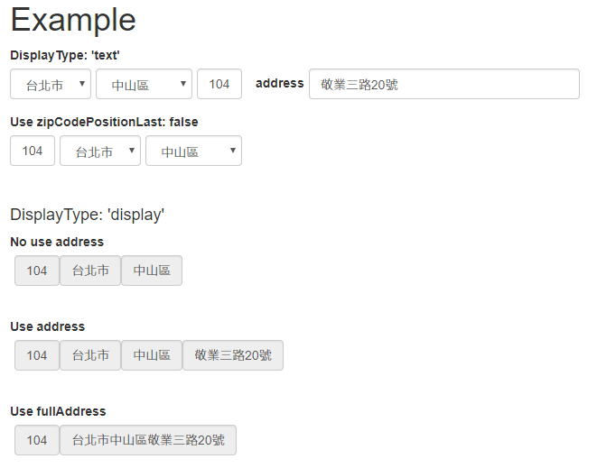

# zipcode-tw-react-example

## Installation

In zipcode-tw-react
```bash
$ cd _example
$ npm install
$ npm run build
```

Open `_example/index.html` and you will see



---
## Useage

程式參考: [Address.js](https://github.com/Chris-Tsai/zipcode-tw-react/blob/master/_example/js/Address.js "Address.js")

#### ZipCodeTW with address
```javascript
<div className="form-inline">
  <ZipCodeTW displayType={this.state.displayType}
             countyValue={this.state.county}
             districtValue={this.state.district}
             zipCodeValue={this.state.zipCode}
             handleChangeCounty={this.handleZipCodeChange}
             handleChangeDistrict={this.handleZipCodeChange}
             handleChangeZipCode={this.handleZipCodeChange}
             handleBlurZipCode={this.handleZipCodeChange}
             handleZipCodeNotExists={this.handleZipCodeNotExists}
  />
  <label style={{marginLeft:'15px'}}>address</label>
  <input name="address" value={this.state.address}
         className="form-control"
         placeholder="輸入地址"
         style={{marginLeft:'5px', width: '300px', display: addressShow}}
         onChange={this.handleChange}
  />
</div>
```

#### Use zipCodePositionLast: false
```javascript
<div className="form-inline">
  <ZipCodeTW displayType={this.state.displayType}
             countyValue={this.state.county}
             districtValue={this.state.district}
             zipCodeValue={this.state.zipCode}
             handleChangeCounty={this.handleZipCodeChange}
             handleChangeDistrict={this.handleZipCodeChange}
             handleChangeZipCode={this.handleZipCodeChange}
             handleBlurZipCode={this.handleZipCodeChange}
             handleZipCodeNotExists={this.handleZipCodeNotExists}
             zipCodePositionLast={false}
  />
</div>
```


#### No use address
```javascript
<div className="form-inline">
  <ZipCodeTW displayType='display'
             countyValue={this.state.county}
             districtValue={this.state.district}
             zipCodeValue={this.state.zipCode}
  />
</div>
```

#### Use address
```javascript
<div className="form-inline">
  <ZipCodeTW displayType='display'
             countyValue={this.state.county}
             districtValue={this.state.district}
             zipCodeValue={this.state.zipCode}
             address={this.state.address}
  />
</div>
```
#### Use fullAddress
```javascript
<div className="form-inline">
  <ZipCodeTW displayType='display'
             countyValue={this.state.county}
             districtValue={this.state.district}
             zipCodeValue={this.state.zipCode}
             fullAddress={fullAddress}
  />
</div>
```
